# Active Directory Home Lab: Windows Server 2025

**🚀 Part 1 of 2: Manual On-Premises Deployment**

*This project covers the manual, foundational setup of an Active Directory environment. To see how I took these concepts and fully automated the deployment in the cloud using Infrastructure as Code, check out* [Automating Active Directory in Azure via Terraform](INSERTING GITHUB AZURE DEPLOYMENT SHORTLY)

### Objective

The primary goal of this project was to deploy a local Windows Server 2025 environment and fully configure it as an Active Directory Domain Controller. I executed this lab to deepen my architectural understanding of Active Directory, and to practice bulk administration tasks utilizing PowerShell.

### Environment & Tools

- **Hypervisor:** Oracle VirtualBox
- **Server OS:** Windows Server 2025 Datacenter (Evaluation)
- **Client OS:** Windows 11 (Evaluation)
- **Virtual Network:** VirtualBox Internal Network (`192.168.10.x` Subnet)

### Step 1: Server Provisioning & Role Installation

To establish the foundation, I provisioned a new virtual machine in VirtualBox and installed the Windows Server 2025 Datacenter Desktop Experience from an ISO. After the initial boot and storage configuration, I utilized the Server Manager dashboard to install the **Active Directory Domain Services (AD DS)** role alongside the Remote Server Administration Tools.

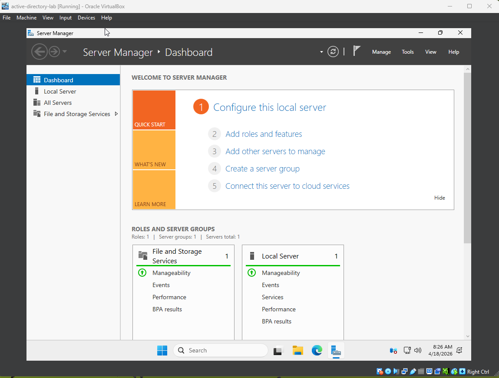

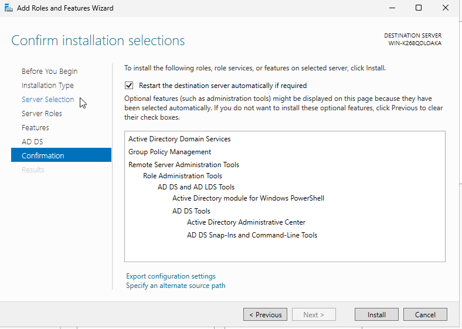

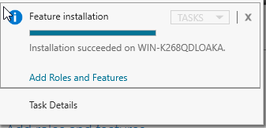

## Step 2: Domain Controller Promotion

With the AD DS role installed, I promoted the server to a Domain Controller to establish a new forest.

- **Root Domain Name:** `lab.local` (Chosen as an unrouted TLD to prevent external DNS conflicts).
- **Functional Level:** Windows Server 2025.
- I completed this promotion via the configuration wizard but documented the equivalent PowerShell deployment commands (`Install-WindowsFeature` and `Install-ADDSForest`) for future automation workflows.

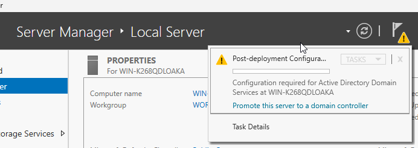

<details>
<summary>View AD-DS Installation Script</summary>

```powershell
Install-WindowsFeature -Name AD-Domain-Services -IncludeManagementTool
```

</details>

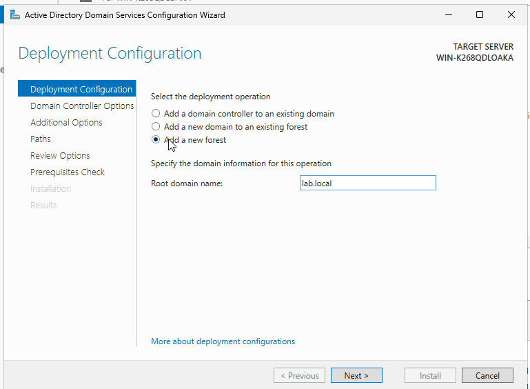

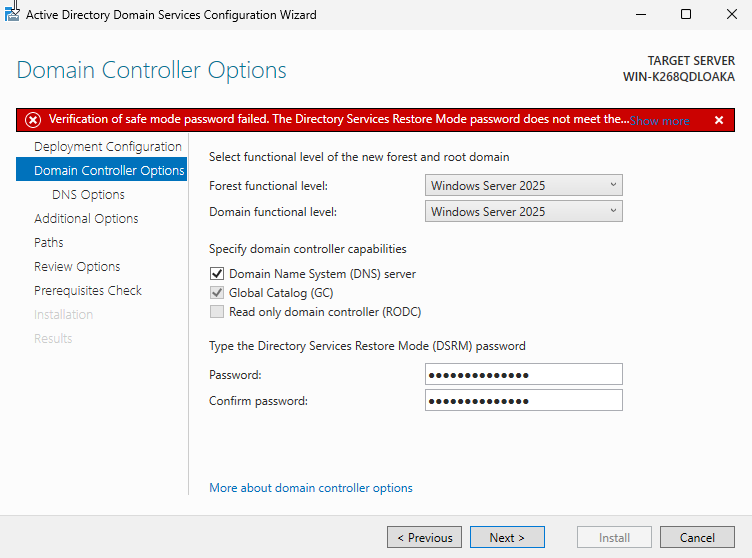

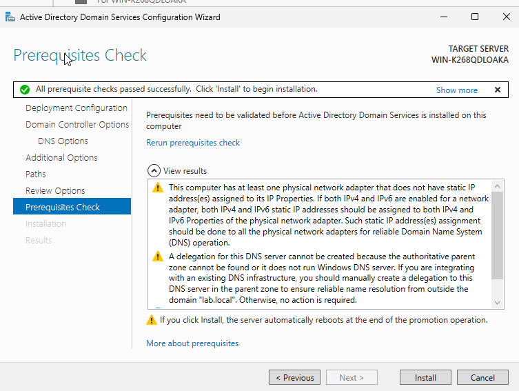

<details>
<summary>View AD Forest Promotion Script</summary>

```powershell
Import-Module ADDSDeployment
Install-ADDSForest -DomainName 'lab.local' -DomainNetBiosName 'LAB' -InstallDns:$true -SafeModeAdministratorPassword (ConvertTo-SecureString 'YourDSRMPassword!' -AsPlainText -Force) -Force:$true
```

</details>

## Step 3: Organizational Structure & Identity Management

To mimic a realistic corporate environment, I bypassed the Active Directory Users and Computers (ADUC) GUI and relied exclusively on PowerShell to build the organizational structure and provision identities.

- Created core Organizational Units (OUs) for IT, Finance, HR, Sales, and Servers.
- Established Global Security Groups mapped to each department.
- Utilized the `ConvertTo-SecureString` cmdlet to set a standardized, secure default password for bulk user creation.
- Provisioned multiple test users (`New-ADUser`) and assigned them to their respective departments.

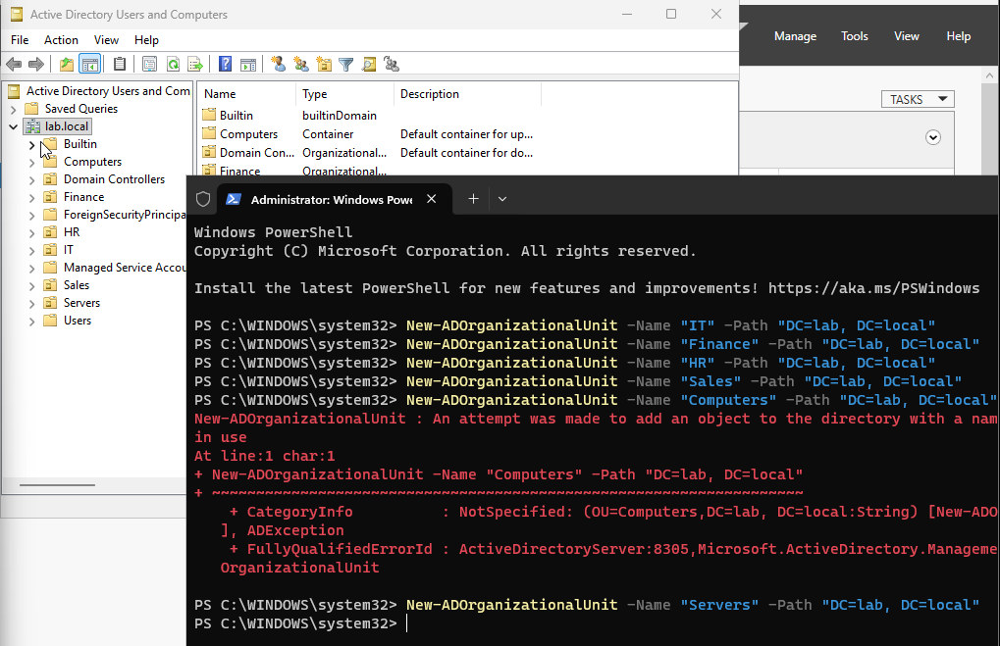

<details>
<summary>View OU Creation Script</summary>

```powershell
New-ADOrganizationalUnit -Name "IT" -Path "DC=lab,DC=local"
New-ADOrganizationalUnit -Name "Finance" -Path "DC=lab,DC=local"
New-ADOrganizationalUnit -Name "HR" -Path "DC=lab,DC=local"
New-ADOrganizationalUnit -Name "Sales" -Path "DC=lab,DC=local"
New-ADOrganizationalUnit -Name "Servers" -Path "DC=lab,DC=local"
```

</details>

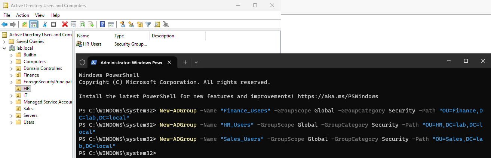

<details>
<summary>View Group Creation Script</summary>

```powershell
New-ADGroup -Name "IT_Admins"     -GroupScope Global -GroupCategory Security -Path "OU=IT,DC=lab,DC=local"
New-ADGroup -Name "Finance_Users" -GroupScope Global -GroupCategory Security -Path "OU=Finance,DC=lab,DC=local"
New-ADGroup -Name "HR_Users"      -GroupScope Global -GroupCategory Security -Path "OU=HR,DC=lab,DC=local"
New-ADGroup -Name "Sales_Users"   -GroupScope Global -GroupCategory Security -Path "OU=Sales,DC=lab,DC=local"
```

</details>

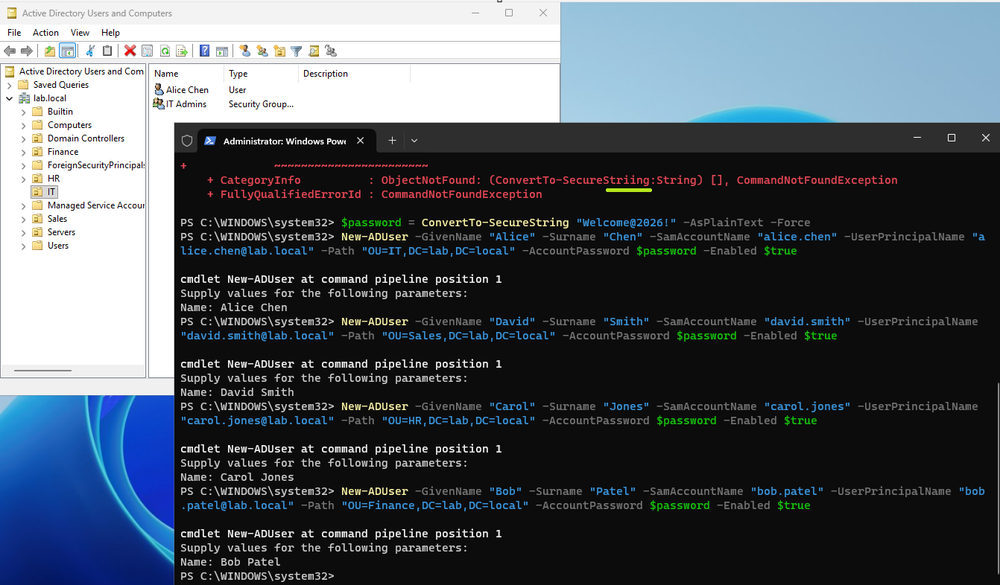

<details>
<summary>View User Provisioning Script</summary>

```powershell
$password = ConvertTo-SecureString "Welcome@2026!" -AsPlainText -Force

New-ADUser -GivenName "Alice" -Surname "Chen" -SamAccountName "alice.chen" -UserPrincipalName "alice.chen@lab.local" -Path "OU=IT,DC=lab,DC=local" -AccountPassword $password -Enabled $true
New-ADUser -GivenName "David" -Surname "Smith" -SamAccountName "david.smith" -UserPrincipalName "david.smith@lab.local" -Path "OU=Sales,DC=lab,DC=local" -AccountPassword $password -Enabled $true
New-ADUser -GivenName "Carol" -Surname "Jones" -SamAccountName "carol.jones" -UserPrincipalName "carol.jones@lab.local" -Path "OU=HR,DC=lab,DC=local" -AccountPassword $password -Enabled $true
New-ADUser -GivenName "Bob" -Surname "Patel" -SamAccountName "bob.patel" -UserPrincipalName "bob.patel@lab.local" -Path "OU=Finance,DC=lab,DC=local" -AccountPassword $password -Enabled $true
```

</details>

## Step 4: Group Policy Object (GPO) Configuration

To enforce baseline security standards across the domain, I renamed the Domain Controller to `LabDC` and created a new "IT Security Policy" GPO containing the following parameters:

- **Password Policy:** Enforced complexity requirements and a 12-character minimum length.
- **Interactive Logon:** Configured a machine inactivity lock after 15 minutes.
- **Removable Storage Access:** Blocked read/write access to all USB devices.

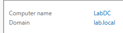

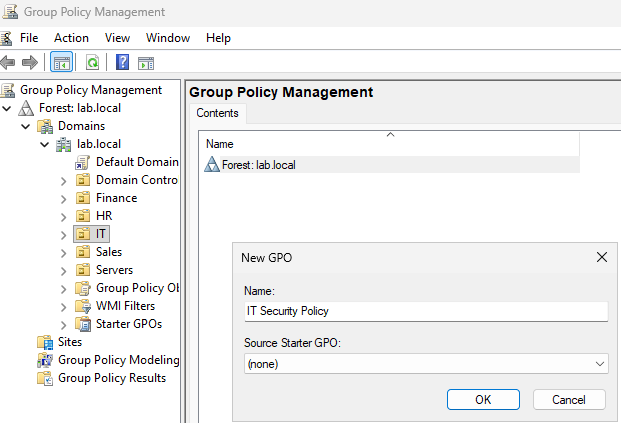

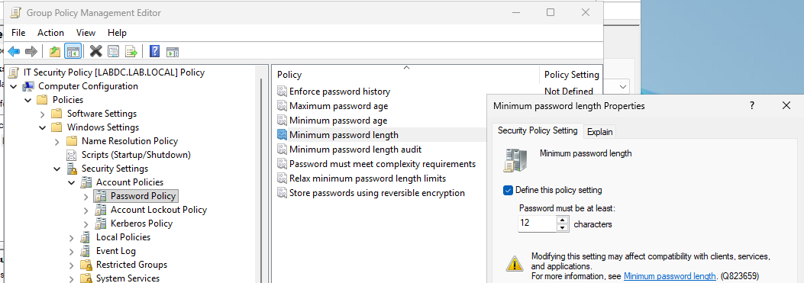

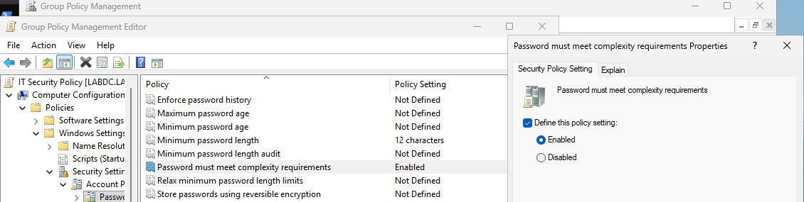

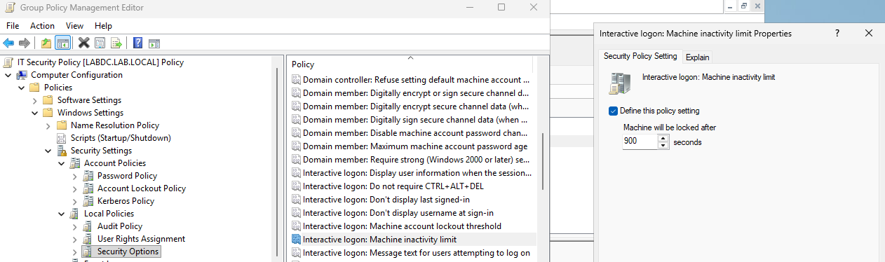

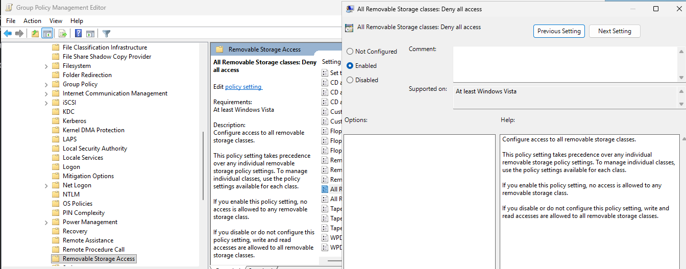

## Step 5: Client Join & Network Troubleshooting

To verify the domain and policies, I spun up a Windows 11 client VM. During this phase, I encountered a communication failure where the client could not ping the Domain Controller.

- **Troubleshooting:** I initially flushed the DNS and restarted the `netlogon` service on the server. Upon further investigation, I identified that VirtualBox's default NAT network was isolating the machines.
- **Resolution:** Reconfigured both network adapters to the VirtualBox "Internal Network", resulting in successful ICMP echo replies and a successful domain join.
- **Verification:** Signed in as a test user and utilized `gpresult /r /scope computer` in an elevated terminal to confirm the IT Security Policy GPO was successfully applied.

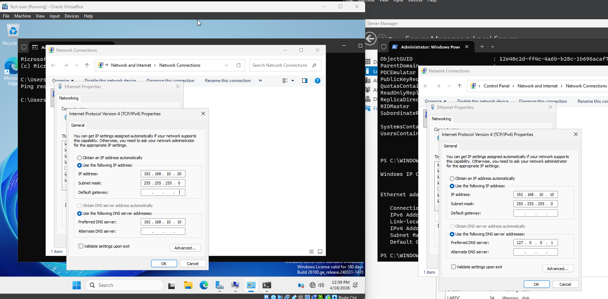

<details>
<summary>View DNS/Netlogon Fix Script</summary>

```powershell
Restart-Service netlogon
ipconfig /registerdns
```

</details>

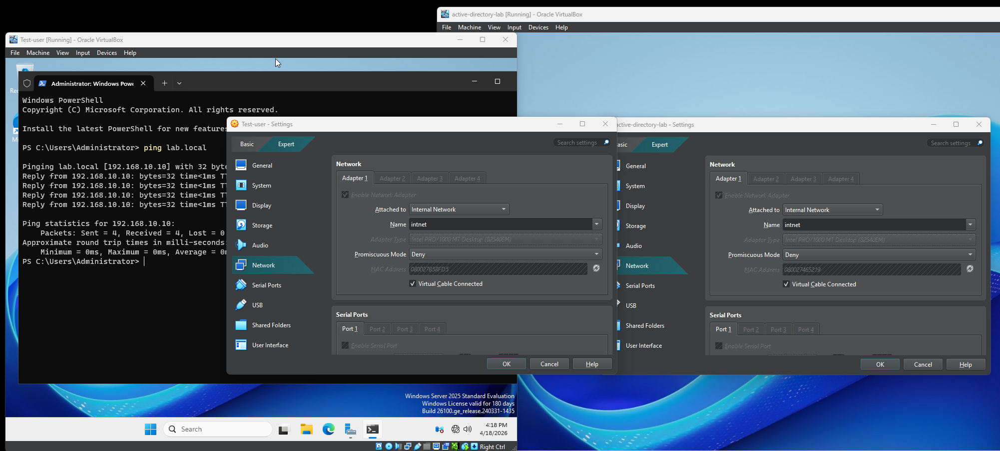

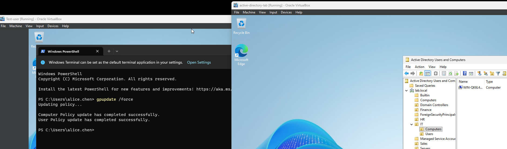

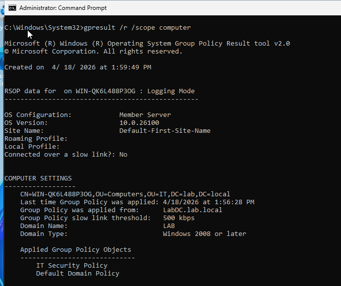

<details>
<summary>View GPResult Validation Command</summary>

```powershell
gpresult /r /scope computer
```

</details>

## Step 6: Routine Administration via PowerShell

For the final phase of the lab, I executed common help desk and systems administration tasks via the command line. This included:

- Resetting user passwords (`Set-ADAccountPassword`).
- Unlocking accounts after manually triggering the lockout threshold (`Unlock-ADAccount`).
- Disabling accounts for simulated employee offboarding (`Disable-ADAccount`).
- Querying the directory for disabled accounts and stale logins (`Search-ADAccount`, `Get-ADUser`).
- Modifying and verifying group memberships (`Add-ADGroupMember`, `Get-ADPrincipalGroupMembership`).

<details>
<summary>View Password Reset Script</summary>

```powershell
Set-ADAccountPassword -Identity "bob.patel" -Reset -NewPassword (ConvertTo-SecureString "NewPass@2026!" -AsPlainText -Force)
Set-ADUser -Identity "bob.patel" -ChangePasswordAtLogon $true
```

</details>

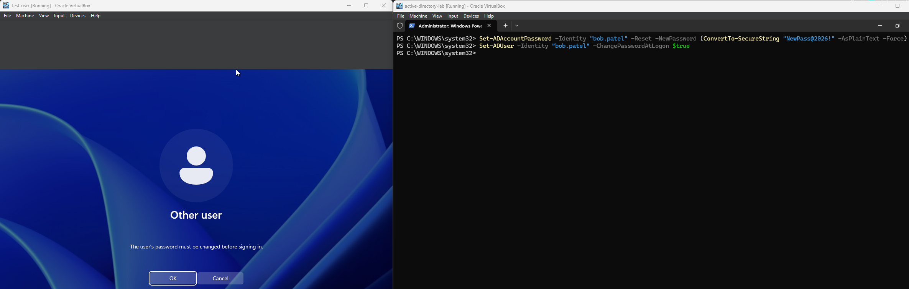

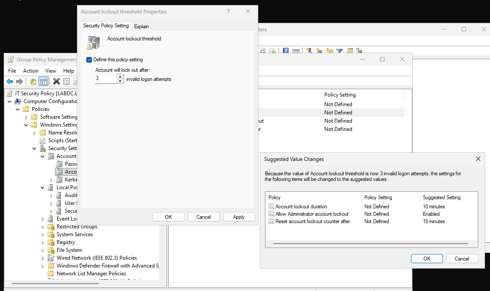

<details>
<summary>View Account Management Script</summary>

```powershell
# Reset a password
Set-ADAccountPassword -Identity "bob.patel" -Reset -NewPassword (ConvertTo-SecureString "NewPass@2026!" -AsPlainText -Force)
Set-ADUser -Identity "bob.patel" -ChangePasswordAtLogon $true

# Unlock a locked account
Unlock-ADAccount -Identity "carol.jones"

# Disable an account (employee offboarding)
Disable-ADAccount -Identity "david.smith"

# Find all disabled accounts
Search-ADAccount -AccountDisabled | Select-Object Name, SamAccountName
```

</details>

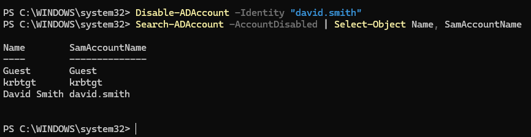

<details>
<summary>View AD Query Script</summary>

```powershell
# Find accounts that haven't logged in for 90 days
$cutoff = (Get-Date).AddDays(-90)
Get-ADUser -Filter {LastLogonDate -lt $cutoff -and Enabled -eq $true} -Properties LastLogonDate | Select-Object Name, LastLogonDate

# Check group membership for a user
Get-ADPrincipalGroupMembership -Identity "alice.chen" | Select-Object Name
```

</details>

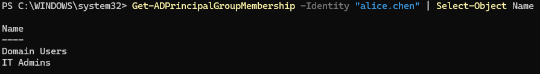

## What I Learned

- **Hypervisor Networking:** Gained practical experience troubleshooting virtual switches and understanding the hard boundaries between NAT and Internal networks in VirtualBox.
- **PowerShell Efficiency:** Reinforced that while the Windows GUI is user-friendly, PowerShell is exponentially faster for bulk provisioning OUs, groups, and users, effectively eliminating repetitive administrative overhead.
- **Policy Verification Constraints:** Discovered that standard users cannot view machine-scoped applied policies; executing `gpresult` for computer scopes strictly requires an elevated administrative terminal.
- **Identity Management:** Successfully simulated the backend management of AD identities, directly supporting my objective to better understand identity sync and profile management.